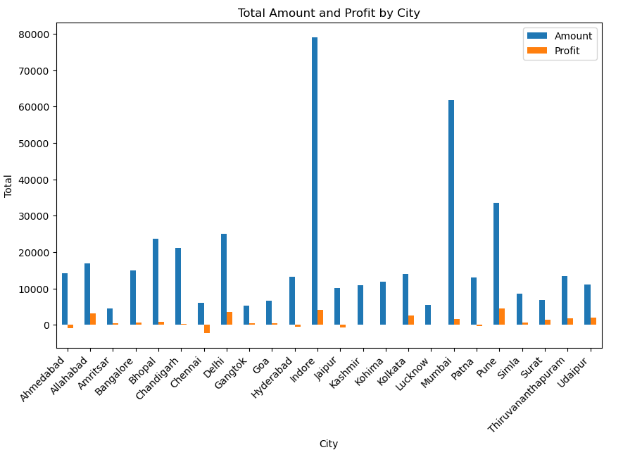

# Sales Analysis

## Project Overview:

### Introduction:
Pandas is a powerful and flexible open-source data manipulation and analysis tool, widely used in the data science and analytics community. This project serves as a template for performing data analysis tasks, and it can be a starting point for various data exploration and manipulation projects.

In addition we created dynamic visualizations with Tableau. Through interactive dashboards and concise charts, we can find sales trends, insights and make informed decisions to drive business growth.

## Key Highlights:

##### Data Cleaning and Preprocessing
Cleaning and preparing data is important for analyzing it. We use Pandas to do this effectively by fixing mistakes, handling missing data, transforming data and organizing variables for analysis.

##### Data Merging and Joining
We have combined 2 CSV files: List of Orders and Order Details wo achieve a larger data set to work with and more mensurable data.

##### Exploratory Data Analysis (EDA)
Exploratory Data Analysis (EDA) is a key step in understanding and analyzing data. It involves examining and visualizing the dataset to uncover patterns, trends, and insights. In our project, we use EDA to gain a deeper understanding of the data and inform subsequent analysis.

##### Data Visualization
I have prepared variuous visual formats like charts or graphs to make it easier to understand. It helps reveal patterns and trends in the data, making complex information more accessible and aiding in better decision-making.

Also I exported the data to Tablue and made several basic analysis graphs.

The project includes a well-documented Jupyter notebook, providing a step-by-step walkthrough of the data analysis process. Additionally, I have prepared a concise report summarizing key findings and insights derived from the analysis.

## Key Findings (pandas):
By grouping by category the summirized amount and profit helps us understand where the bulk of the revenew is coming from:

We can see that the amount sold of goods is divided equally between the 3 categories, with Electronics accounting for 38.3%, Clothing for 32.2%, and Furniture for 29.5%.

When we look at the amount of profit those categories provided, there is a distinct difference. Although all categories are sold in equal amounts, the profits mainly come from Clothing (46.6%) and Electronics (43.8%), and lastly Furniture (9.6%).

My insight would be to focus on Electronics and Clothing and not invest in Furniture because its profitability is quite low to start with and would require a lot of resources to become profitable like the other categories. However, if the existence of Furniture is crucial, so perhaps increasing the prices of the items or tailoring them to a specific demographic could be considered.

We can group by same elements but by a diffrent category as city and see what information we can infer from it:

We can extract the "best" and "worse" clients the company addresses and add personalized service, exclusive offers and discounts or on the other hand add clear boundaries, escalation procedure, learning opportunities to help sturgling clients.

## Key Findings (Tableau):

